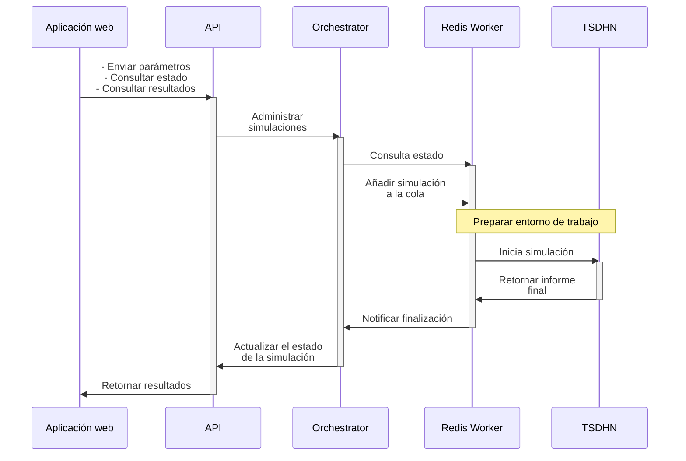

# Orchestrator-TSDHN

<!-- prettier-ignore-start -->
| Coverage | Seguridad | Calidad |
| -------- | --------- | ------- |
| [](https://github.com/totallynotdavid/picv-2025/actions/workflows/coverage.yml) | [](https://github.com/totallynotdavid/picv-2025/actions/workflows/codeql.yml) [](https://github.com/totallynotdavid/picv-2025/actions/workflows/security.yml) | [](https://github.com/totallynotdavid/picv-2025/actions/workflows/pre-commit.yml)
<!-- prettier-ignore-end -->

El Orchestrator-TSDHN es una herramienta para la estimación de parámetros de tsunamis de origen lejano mediante simulaciones numéricas. Combina el **modelo TSDHN escrito en Fortran** (en la carpeta [`/model`](/model/)) con una **API escrita en Python** (en la carpeta [`/orchestrator`](/orchestrator/)) que procesa datos sísmicos iniciales, como la ubicación y la magnitud de un terremoto, para calcular variables como: dimensiones de ruptura sísmica, momento sísmico y desplazamiento de la corteza. Estos valores son utilizados finalmente en la simulación principal, cuyo resultado incluye un informe en formato PDF con mapas de propagación, gráficos de mareógrafos y datos técnicos, además de un archivo de texto con tiempos de arribo a estaciones costeras predefinidas.

> [!IMPORTANT]
> La lógica de los cálculos numéricos reside en este repositorio, mientras que la [interfaz web](https://github.com/totallynotdavid/picv-2025-web) (que gestiona solicitudes y entrega el informe al usuario final) opera en un entorno separado.

A continuación, se muestra un diagrama que ilustra el flujo general del Orchestrator-TSDHN:



## Instalación

El proyecto requiere **Ubuntu 24.04** o superior y de, al menos, 15 GB de espacio libre en disco. Usuarios de Windows deben configurar Windows Subsystem for Linux (WSL 2.0 o superior) siguiendo la [<kbd>guía oficial</kbd>](https://learn.microsoft.com/es-es/windows/wsl/install) de Microsoft antes de continuar.

### Prerrequisitos

Ejecuta `bash utils/setup-env.sh` para instalar automáticamente todas las dependencias mencionadas en esta sección. Recuerda darle permisos de ejecución con `chmod +x utils/setup-env.sh`. Si prefieres instalar manualmente, sigue los pasos a continuación.

Antes de comenzar, actualiza los paquetes del sistema:

```bash
sudo apt update -y && sudo apt upgrade -y
```

1. **Python** se gestiona a través de [mise](https://mise.jdx.dev), que fija la versión declarada en [`mise.toml`](./mise.toml) (3.14.x) y crea el entorno virtual de forma reproducible. Para instalarlo:

   ```bash
   curl -fsSL https://mise.run | sh
   ```

   Activa mise en tu shell (bash) [[1](https://mise.jdx.dev/getting-started.html#activate-mise)]:

   ```bash
   echo 'eval "$(~/.local/bin/mise activate bash)"' >> ~/.bashrc
   source ~/.bashrc
   ```

   Instala la versión de Python declarada en el proyecto:

   ```bash
   mise install
   mise use python@3.14
   ```

   Verifica la instalación:

   ```bash
   python3 -V
   ```

2. [**uv**](https://docs.astral.sh/uv) es el gestor de paquetes y entornos del proyecto. uv reemplaza a `pip`, `poetry` y `pip-tools`: resuelve, bloquea e instala dependencias en un único `uv.lock`, y maneja múltiples paquetes en este monorepo:

   ```bash
   mise exec -- uv --version
   ```

   uv se instala automáticamente con `mise install` (ya está fijado en `mise.toml`).

   **Alternativa**: Si no usas mise, instala uv siguiendo las [instrucciones oficiales](https://docs.astral.sh/uv/getting-started/installation/).

3. [**TTT SDK**](https://www.geoware-online.com/tsunami.html) (Tsunami Travel Time) calcula los tiempos de arribo de un tsunami a partir de la batimetría de una cuadrícula geográfica (el océano Pacífico en nuestro caso). Para instalarlo, necesitas Git LFS para poder descargar los datos y CMake para compilación:

   ```bash
   sudo apt install -y git-lfs cmake
   ```

   Para instalar el SDK, ejecuta:

   ```bash
   git clone https://gitlab.com/totallynotdavid/tttapi/
   cd tttapi && make config compile && sudo make install datadir docs
   make test clean
   ```

   **Nota**: Alojamos el SDK en GitLab para aprovechar su política gratuita de LFS (Git Large File Storage) y reducir la carga en los servidores de los autores durante nuestras pruebas de CI/CD.

4. [**TeXLive**](https://www.tug.org/texlive/quickinstall.html), específicamente pdflatex, es utilizado para generar los informes en PDF. Realizamos una instalación mínima para optimizar espacio:

   ```bash
   cd /tmp
   wget https://mirror.ctan.org/systems/texlive/tlnet/install-tl-unx.tar.gz
   zcat < install-tl-unx.tar.gz | tar xf -
   cd install-tl-2*
   ```

   Crea un perfil de instalación (<kbd>texlive.profile</kbd>) que selecciona solo los componentes a instalar:

   ```bash
   cat > texlive.profile << EOF
   selected_scheme scheme-basic
   tlpdbopt_autobackup 0
   tlpdbopt_install_docfiles 0
   tlpdbopt_install_srcfiles 0
   EOF
   ```

   Instalamos en el directorio del usuario para evitar problemas de permisos y el [modo usuario](https://www.tug.org/texlive/doc/tlmgr.html#USER-MODE) de TeXLive [[5](https://tex.stackexchange.com/a/676880)]:

   ```bash
   perl ./install-tl --profile=texlive.profile \
                     --texdir "$HOME/texlive" \
                     --texuserdir "$HOME/.texlive" \
                     --no-interaction
   ```

   Configura el <kbd>PATH</kbd>:

   ```bash
   echo -e '\nexport PATH="$HOME/texlive/bin/x86_64-linux:$PATH"' >> ~/.bashrc
   source ~/.bashrc
   ```

   Instala los paquetes LaTeX necesarios:

   ```bash
   tlmgr update --self && tlmgr install babel-spanish hyphen-spanish booktabs
   ```

5. [**Intel® Fortran Essentials**](https://www.intel.com/content/www/us/en/docs/oneapi/installation-guide-linux/2025-1/online-offline-installer-003.html) permite generar ejecutables optimizados a partir de nuestro código Fortran, antes con `ifort` y ahora con `ifx` [[6](https://www.intel.com/content/www/us/en/developer/articles/release-notes/fortran-compiler/2025.html)]. Descarga el instalador:

   ```bash
   wget https://registrationcenter-download.intel.com/akdlm/IRC_NAS/306e03be-1259-4d71-848a-59e23013c4f0/intel-fortran-essentials-2025.1.0.556_offline.sh
   ```

   **Nota**: Este archivo pesa aproximadamente 951 MB.

   Instala el compilador:

   ```bash
   chmod +x intel-fortran-essentials-*.sh
   ./intel-fortran-essentials-*.sh -a --silent --eula accept
   ```

   Configura el entorno para que `setvars.sh` añada las rutas necesarias al <kbd>PATH</kbd>:

   ```bash
   echo '[ -f "$HOME/intel/oneapi/setvars.sh" ] && source "$HOME/intel/oneapi/setvars.sh" > /dev/null' >> ~/.bashrc
   source ~/.bashrc
   ```

6. **Generic Mapping Tools (GMT)**: Como parte de nuestra migración a Python, utilizamos `pygmt` que requiere GMT >= 6.4.0 [[7](https://www.pygmt.org/dev/install.html#which-gmt)]. Compilamos desde el código fuente para evitar dependencias adicionales (e.g. conda) y garantizar compatibilidad en entornos limitados.

   **Importante**: No es recomendable usar `sudo apt install gmt` ya que los repositorios oficiales generalmente ofrecen la versión 6.0.0, que no es compatible con `pygmt`.

   Crea un directorio temporal para la compilación:

   ```bash
   GMT_BUILD_DIR=$(mktemp -d)
   cd "$GMT_BUILD_DIR"
   ```

   Descarga el código fuente y los datos de soporte:

   ```bash
   git clone --depth 50 https://github.com/GenericMappingTools/gmt

   wget https://github.com/GenericMappingTools/gshhg-gmt/releases/download/2.3.7/gshhg-gmt-2.3.7.tar.gz
   tar xzf gshhg-gmt-2.3.7.tar.gz

   wget https://github.com/GenericMappingTools/dcw-gmt/releases/download/2.1.1/dcw-gmt-2.1.1.tar.gz
   tar xzf dcw-gmt-2.1.1.tar.gz
   ```

   Crea el archivo de configuración:

   ```bash
   cat > gmt/cmake/ConfigUser.cmake << EOF
   set (CMAKE_INSTALL_PREFIX "/usr/local")
   set (GSHHG_ROOT "${GMT_BUILD_DIR}/gshhg-gmt-2.3.7")
   set (DCW_ROOT "${GMT_BUILD_DIR}/dcw-gmt-2.2.0")
   EOF
   ```

   Compila e instala GMT:

   ```bash
   mkdir -p gmt/build
   cd gmt/build
   cmake .. -G Ninja
   cmake --build .
   sudo cmake --build . --target install
   sudo ldconfig
   ```

   Verifica la instalación:

   ```bash
   gmt --version
   ```

   Limpia el directorio temporal:

   ```bash
   cd
   rm -rf "$GMT_BUILD_DIR"
   ```

7. **Dependencias adicionales**: `redis-server`, `ps2eps`, `csh`. Ejecuta:

   ```bash
   sudo apt install -y gfortran redis-server ps2eps csh
   ```

   Configura Redis para usar systemd:

   ```bash
   sudo sed -i 's/^# \?supervised \(no\|auto\)/supervised systemd/' /etc/redis/redis.conf
   sudo systemctl restart redis-server
   ```

8. **Opcional**: Si necesitas ejecutar la interfaz gráfica original ([<kbd>tsunami.m</kbd>](model/tsunami.m)), instala [MATLAB R2014](https://drive.google.com/file/d/1VhLnwXX78Y7O8huwlRuE-shOW2LKlVpd/view?usp=drive_link).

### Iniciar el proyecto

1. Clona el repositorio e instala las dependencias (incluye los dos paquetes `orchestrator` y `cli` del workspace):

   ```bash
   git clone https://github.com/totallynotdavid/picv-2025
   cd picv-2025
   mise install        # instala Python 3.12 y uv declarados en mise.toml
   uv sync --all-packages
   ```

   Esto crea un `.venv/` en la raíz con todos los paquetes del workspace instalados en modo editable.

2. Valida la instalación con:

   ```bash
   uv run pytest       # Todos los tests deben pasar
   ```

3. Para iniciar la API, ejecuta:

   ```bash
   uv run tsdhn-api
   ```

   La API estará disponible en `http://localhost:8000`.

   Si estás modificando el código y quieres que la aplicación se recargue automáticamente cuando hagas cambios, entonces usa uvicorn directamente:

   ```bash
   uv run uvicorn orchestrator.main:app --reload
   ```

   En un nuevo terminal, ejecuta el siguiente comando para iniciar el RQ worker:

   ```bash
   uv run rq worker tsdhn_queue
   ```

> [!TIP]
> Si deseas probar el modelo con condiciones específicas, consulta la sección de [pruebas personalizadas](#pruebas-personalizadas).

## Estructura del proyecto

El repositorio es un **workspace de uv** con dos paquetes Python publicables más los activos del modelo Fortran y los datos de soporte:

```txt
picv-2025/
├── pyproject.toml               # Workspace root: declara miembros y tool.uv.workspace
├── uv.lock                      # Lockfile único compartido por todos los paquetes
├── mise.toml                    # Pinea Python 3.12 y uv
├── packages/
│   ├── orchestrator/            # Servicio FastAPI + RQ worker
│   │   ├── pyproject.toml
│   │   ├── src/orchestrator/
│   │   │   ├── main.py          # Punto de entrada de la API y definiciones de endpoints
│   │   │   ├── core/
│   │   │   │   ├── calculator.py    # Clase TsunamiCalculator y lógica del cálculo inicial
│   │   │   │   ├── config.py        # Constantes globales y configuración del pipeline
│   │   │   │   └── queue.py         # Gestión de cola de simulaciones
│   │   │   ├── models/
│   │   │   │   └── schemas.py       # Schemas de validación y transformación de datos
│   │   │   ├── modules/
│   │   │   │   ├── maxola.py        # Mapa de máxima altura de propagación del tsunami
│   │   │   │   ├── point_ttt.py     # Mapa de tiempos de arribo
│   │   │   │   ├── reporte.py       # Informe final
│   │   │   │   ├── ttt_inverso.py
│   │   │   │   └── ttt_max.py       # Mareogramas
│   │   │   └── utils/
│   │   │       └── geo.py           # Cálculos geográficos (distancias, formatos, etc.)
│   │   └── tests/                   # Suite de pytest del orchestrator
│   └── cli/                    # Cliente CLI
│       ├── pyproject.toml
│       └── src/cli/
│           ├── cli.py              # Entry point (`uv run tsdhn`)
│           ├── main.py
│           ├── api.py
│           ├── config.py
│           ├── constants.py
│           ├── core.py
│           └── ui.py
├── model/                       # Activos del modelo Fortran (no es un paquete Python)
│   ├── pacifico.mat             # Datos de batimetría del Océano Pacífico
│   ├── maper1.mat               # Datos de puntos costeros
│   ├── mecfoc.dat               # Base de datos histórica de mecanismos focales
│   ├── puertos.txt              # Lista de puertos para cálculos de tiempo de llegada
│   └── job.run                  # (Deprecated) Script de ejecución de simulación en C Shell
├── data/                        # Datos auxiliares (no es un paquete Python)
│   └── stations.yml
└── utils/                       # Scripts de shell auxiliares (no es un paquete Python)
    ├── copy-repo.sh
    └── setup-env.sh
```

## Endpoints de la API

El servicio expone varios endpoints para la gestión de simulaciones sísmicas. Todas las solicitudes deben incluir el encabezado HTTP `Content-Type: application/json` y utilizan identificadores UUIDv4 para gestionar las simulaciones.

1. [`POST /run-simulation`](orchestrator/main.py?plain=1#L30) inicia una nueva simulación. Requiere un cuerpo JSON con parámetros sísmicos validados mediante modelos Pydantic ([`schemas.py`](orchestrator/models/schemas.py)).

   Los parámetros requeridos incluyen:

   | Parámetro | Tipo                                 | Descripción                                   |
   | --------- | ------------------------------------ | --------------------------------------------- |
   | `Mw`      | decimal (6.5 a 9.5)                  | Magnitud de momento sísmico                   |
   | `h`       | decimal (>0)                         | Profundidad hipocentral en kilómetros         |
   | `lat0`    | decimal (-90 a 90)                   | Latitud epicentral en grados decimales        |
   | `lon0`    | decimal (-180 a 180)                 | Longitud epicentral en grados decimales       |
   | `dia`     | string (formato DD con cero inicial) | Día del evento (ej. "07")                     |
   | `hhmm`    | string (formato HHMM)                | Hora del evento (ej. "1430" para 2:30 PM UTC) |

   Un ejemplo de solicitud sería:

   <details>
   <summary>Ejemplo de solicitud</summary>

   ```json
   {
     "Mw": 7.5,
     "h": 10.0,
     "lat0": -20.5,
     "lon0": -70.5,
     "dia": "15",
     "hhmm": "1430"
   }
   ```

   </details>

   La respuesta esperada para esta solicitud contiene el identificador único de la simulación:

   <details>
   <summary>Ejemplo de respuesta esperada (HTTP 201)</summary>

   ```json
   {
     "job_id": "dee661ec-1c39-47e5-bb50-3926fa70bb8e"
   }
   ```

   </details>

2. [`GET /job-status/{job_id}`](orchestrator/main.py?plain=1#L47) provee información detallada sobre simulaciones en curso o finalizadas. La respuesta incluye:

   - El estado actual de la simulación (queued, running, completed, failed)
   - Los parámetros de ruptura sísmica calculados
   - Los tiempos de arribo a estaciones definidas en [`puertos.txt`](model/puertos.txt)
   - Las coordenadas del rectángulo del plano de falla para visualización geoespacial
   - Los metadatos temporales y URL de descarga (disponible 72 horas post-completado)

   Un ejemplo de solicitud sería:

   <details>
   <summary>Ejemplo de solicitud</summary>

   ```json
   {
     "job_id": "dee661ec-1c39-47e5-bb50-3926fa70bb8e"
   }
   ```

   </details>

   Un ejemplo de respuesta esperada sería:

   <details>
   <summary>Ejemplo de respuesta esperada</summary>

   ```json
   {
     "status": "completed",
     "calculation": {
       "length": 575.44,
       "width": 144.54,
       "dislocation": 10.64,
       "seismic_moment": 3.98e22,
       "tsunami_warning": "Genera un tsunami grande...",
       "distance_to_coast": 10439.47,
       "rectangle_corners": [
         { "lat": 56.44, "lon": -153.34 }
         { "__comment": "Otras coordenadas, omitidas por brevedad" }
       ]
     },
     "travel_times": {
       "arrival_times": {
         "-80.58, -03.0": "12:09 23Mar",
         "__comment": "Otras estaciones, omitidas por brevedad"
       },
       "distances": {
         "-80.58, -03.0": 9445.79,
         "__comment": "Otras distancias, omitidas por brevedad"
       },
       "epicenter_info": {
         "date": "23",
         "time": "0000",
         "latitude": "56.00",
         "longitude": "-156.00"
       }
     },
     "details": "Job completed successfully",
     "error": null,
     "created_at": "2025-02-17T19:46:08.171522",
     "started_at": "2025-02-17T19:46:08.345851",
     "ended_at": "2025-02-17T20:27:44.304036",
     "download_url": "/job-result/dee661ec-1c39-47e5-bb50-3926fa70bb8e/reporte.pdf"
   }
   ```

   </details>

> [!TIP]
> Los objetos `calculation` y `travel_times` se añaden inmediatamente después de ser calculados. No es necesario esperar a que finalice la simulación para obtener estos datos.

3. [`GET /job-result/{job_id}`](orchestrator/main.py?plain=1#L61)permite descargar el informe técnico en formato PDF cuando el estado es `completed`. Requiere el encabezado `Accept: application/pdf`.

   Un ejemplo de uso directo sería:

   ```
   http://localhost:8000/job-result/dee661ec-1c39-47e5-bb50-3926fa70bb8e
   ```

4. [`GET /health`](orchestrator/main.py?plain=1#L97) verifica la disponibilidad del servicio y su conexión con Redis.

   Una respuesta esperada sería:

   <details>
   <summary>Ejemplo de respuesta esperada</summary>

   ```json
   {
     "status": "healthy",
     "timestamp": "2025-03-05T14:26:45.150833",
     "redis_connected": true
   }
   ```

   </details>

Todas las respuestas de error siguen el formato RFC 7807 con códigos HTTP semánticos. Los recursos generados se purgan automáticamente tras 72 horas de inactividad.

## Pruebas personalizadas

Además de las pruebas unitarias ubicadas en [`orchestrator/tests/`](orchestrator/tests/), el repositorio incluye una interfaz de línea de comandos (CLI) para ejecutar simulaciones directamente mediante la API. Esta herramienta resulta particularmente útil para validaciones rápidas en entornos con recursos limitados o para realizar pruebas preliminares.

Para iniciar el CLI **en modo estándar**, ejecute:

```bash
uv run tsdhn
```

El CLI utiliza los parámetros predeterminados definidos en [`cli/constants.py`](cli/constants.py?plain=1#L8), los cuales pueden modificarse interactivamente al usar el CLI. Durante el proceso, para mantener los valores predeterminados, simplemente presiona <kbd>Enter</kbd> para continuar.

El flujo de ejecución sigue tres etapas secuenciales:

1. Verificación de conectividad con la API (URL predeterminada: `http://localhost:8000`).
2. Búsqueda del archivo `configuracion_simulacion.json` en el directorio raíz. Si no existe, se genera automáticamente con los valores predeterminados o los proporcionados por el usuario.
3. Ejecución secuencial de los endpoints `/calculate` (parámetros iniciales), `/tsunami-travel-times` (cálculo de tiempos de arribo) y `/run-tsdhn` (simulación completa).

Tras iniciar el endpoint `run-tsdhn`, el CLI genera en el directorio raíz el archivo `last_job_id.txt` con un identificador único de la simulación. Cuando el parámetro `save_results` está activado (valor predeterminado: `true`), el informe PDF resultante se almacenará en este mismo directorio una vez finalizado el proceso.

También puedes personalizar la configuración editando manualmente el archivo `configuracion_simulacion.json`. Este archivo solo se regenera automáticamente durante la primera ejecución o si ha sido eliminado previamente.

### Modo de desarrollo

Para escenarios de depuración o desarrollo, el CLI ofrece un modo avanzado que permite controlar etapas específicas del pipeline de procesamiento (por ahora, solo `run-tsdhn` es compatible).

Para iniciar el CLI **en modo de desarrollo**, ejecute:

```bash
uv run tsdhn --dev
```

Este modo permite omitir componentes específicos de la cadena de procesamiento definida en `PROCESSING_PIPELINE` en [`orchestrator/core/queue.py`](orchestrator/core/queue.py?plain=1#L95). Esta funcionalidad resulta especialmente útil considerando que la ejecución completa del modelo TSDHN puede requerir entre 25 y 50 minutos.

La(s) etapa(s) omitida(s) se guardan en `configuracion_simulacion.json` en el campo `skip_steps`. Este registro es temporal y no persiste entre ejecuciones del CLI, incluso en modo desarrollo. Deberás especificar nuevamente las etapas a omitir en cada ejecución.

> [!CAUTION]
> Omitir etapas **invalida los resultados**. Use esta función solo para diagnóstico técnico. Los informes generados no son válidos para análisis científico ni toma de decisiones.

## Notas adicionales

- La API guarda automáticamente algunos eventos en `tsunami_api.log`. Puedes configurar el logger en [`config.py`](/orchestrator/core/config.py) si deseas. El archivo de logs se crea cuando inicias la API.
- Si estás haciendo pruebas y quieres ver los logs en tu terminal mientras usas `pytest`, solo necesitas cambiar una línea en [`pyproject.toml`](pyproject.toml):

  ```toml
  [tool.pytest.ini_options]
  log_cli = true
  ```

  Es recomendable usar `logger.debug()` en vez de `print()` o sino pytest lo ignorará.

- Cuando termines de hacer cambios en el código, y antes de hacer commit, ejecuta:

  ```bash
  uv run pytest
  uv run ruff format && uv run ruff check --fix
  ```

  para formatear el código y asegurarte de todo sigue funcionando correctamente.

[^1]: GMT 6.0.0 está en APT, pero `pygmt` requiere ≥6.4.0. Ubuntu 24.04 incluye la versión 6.5.0. Actualiza o compila los ejecutables siguiendo: https://github.com/GenericMappingTools/gmt/blob/master/BUILDING.md.
