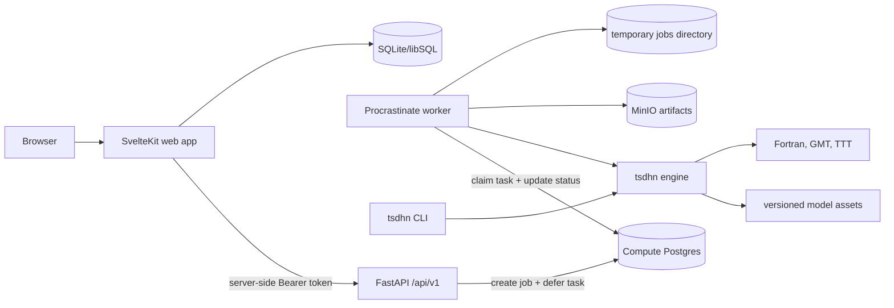

# TSDHN orchestrator

<!-- prettier-ignore-start -->
<div align="center">

[](https://github.com/totallynotdavid/tsdhn/actions/workflows/ci.yml)
[](https://github.com/totallynotdavid/tsdhn/actions/workflows/ci.yml)
[](https://github.com/totallynotdavid/tsdhn/actions/workflows/security.yml)
[](https://scorecard.dev/viewer/?uri=github.com/totallynotdavid/tsdhn)

</div>
<!-- prettier-ignore-end -->

TSDHN orchestrator runs tsunami simulation workflows from earthquake source
parameters. The repository contains one shared `tsdhn` simulation engine and
research CLI, a FastAPI compute adapter, a Procrastinate worker, a SvelteKit
web app, and the generated TypeScript API client used by the web server.

## Documentation

| Area | Docs | Covers |
| --- | --- | --- |
| Python engine + CLI | [`packages/tsdhn`](./packages/tsdhn/readme.md) | Calculations, runtime paths, model assets, pipeline execution |
| API service | [`packages/api`](./packages/api/readme.md) | FastAPI routes, service-token auth, worker entry point |
| Web app | [`apps/web`](./apps/web/readme.md) | SvelteKit app, auth, database, and server-side backend configuration |
| API client | [`libs/api-client`](./libs/api-client/readme.md) | OpenAPI schema and generated TypeScript types |

> [!TIP]
> Start with the component README for the package or app you are changing. The root
> README gives orientation and shared commands; component READMEs carry the
> exact usage details for their own layer.

## Architecture



The browser talks to the SvelteKit app. The SvelteKit server calls the FastAPI
backend with `BACKEND_SERVICE_TOKEN`; that token is never sent to browser code.
Long simulations run in the Procrastinate worker, which calls the shared
`tsdhn` engine, updates `compute_jobs` in Postgres, and writes artifact bundles
and metadata to MinIO.

## Quick start

The backend stack is self-hosted because the simulation runtime needs the
Fortran/GMT/TTT toolchain. Docker Compose uses the images and Dockerfiles
under [`deploy/`](./deploy/).

```sh
cp .env.example .env
docker compose up -d
```

Set `BACKEND_SERVICE_TOKEN` and `BETTER_AUTH_SECRET` in `.env` before running
the web profile:

```sh
docker compose --profile web up
```

For local development, install the pinned tools with
[mise](https://mise.jdx.dev/getting-started.html), then install the Python
workspace:

```sh
mise install
mise run install
mise run test
```

The repository uses [uv](https://docs.astral.sh/uv/) for Python packages and
[Bun](https://bun.sh/docs) for the web workspace. Windows users run the
scientific backend under WSL 2; Microsoft documents the setup in the
[WSL install guide](https://learn.microsoft.com/windows/wsl/install).

## Common commands

| Command | Purpose |
| --- | --- |
| `mise run install` | Install all Python workspace packages with dev and build groups |
| `mise run test` | Run the Python test suite with `pytest -n auto` |
| `mise run lint` | Run Ruff and mypy for Python packages |
| `mise run api` | Start the FastAPI service with `tsdhn-api` |
| `mise run worker` | Start the Procrastinate worker with `tsdhn-worker` |
| `mise run web-dev` | Start the SvelteKit dev server |
| `mise run gen-client` | Export FastAPI OpenAPI JSON and regenerate TypeScript types |
| `docker compose up -d` | Run Postgres, MinIO, libSQL, API, and worker |
| `docker compose --profile web up` | Run the backend stack plus the SvelteKit web app |

## Workspace

```txt
picv-2025/
├── apps/
│   └── web/                  # SvelteKit app and server-side web routes
├── deploy/                   # Dockerfiles for toolchain, API, and web images
├── libs/
│   └── api-client/           # Generated TypeScript client from FastAPI OpenAPI
├── model/                    # TSDHN model assets and legacy Fortran sources
├── packages/
│   ├── api/                  # FastAPI compute service and Procrastinate worker
│   └── tsdhn/                # Shared engine, runtime, assets, and CLI
├── scripts/
│   ├── export_openapi.py     # FastAPI schema export
│   └── gen-client.ts         # OpenAPI TypeScript generation
├── docker-compose.yml
├── mise.toml                 # Tool versions and repo tasks
├── package.json              # Bun workspaces for apps/* and libs/*
├── pyproject.toml            # uv workspace for packages/*
└── uv.lock
```

## Runtime notes

`tsdhn` validates model and tool paths before running simulations.
Non-container backend runs need:

- `TSDHN_MODEL_DIR` pointing at the model asset directory.
- `TSDHN_TOOLS_DIR` pointing at prebuilt `fault_plane`, `deform`, and `tsunami`
  executables when command pipeline steps are active.
- `TSDHN_JOBS_DIR` for temporary simulation workspaces when running the API worker.

The Docker API image sets these paths to `/app/model`, `/app/tools`, and
`/app/jobs`.

<details>
<summary>Scientific runtime dependencies for non-container backend runs</summary>

The containerized path is the maintained setup for the backend runtime.
Non-container runs must provide the same external tools:

- Intel Fortran compiler (`ifx`) from
  [Intel oneAPI Fortran Essentials](https://www.intel.com/content/www/us/en/docs/oneapi/installation-guide-linux/latest/overview.html)
- [Generic Mapping Tools](https://docs.generic-mapping-tools.org/latest/)
- [TTT SDK](https://www.geoware-online.com/tsunami.html), including
  `ttt_client`
- `ps2eps` and `csh`

</details>

## License

This project is licensed under the terms declared in
[`pyproject.toml`](./pyproject.toml).
